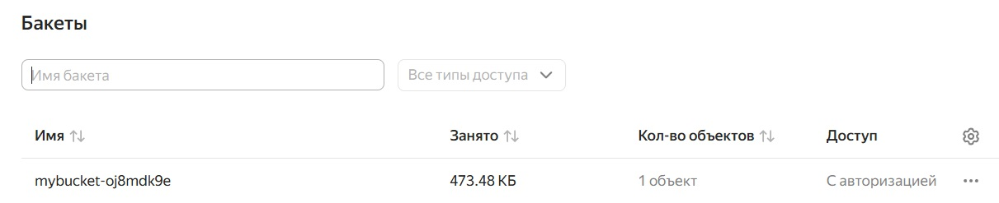
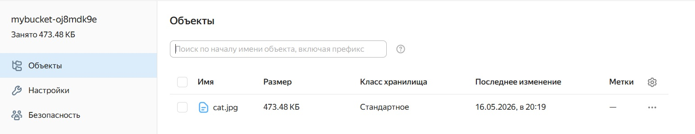
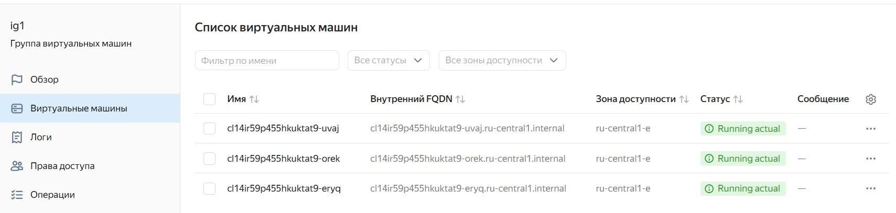
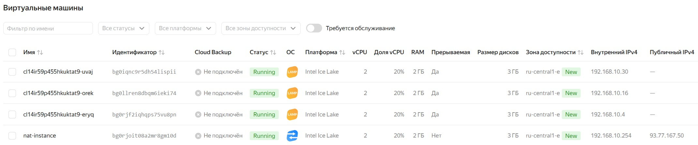
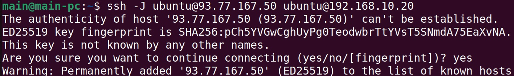
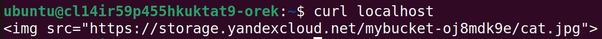
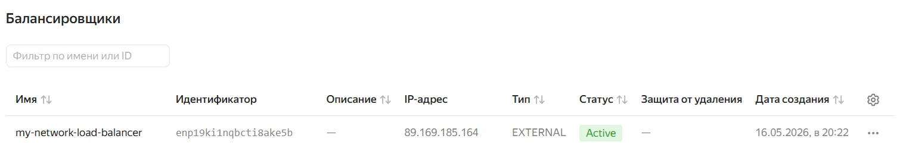
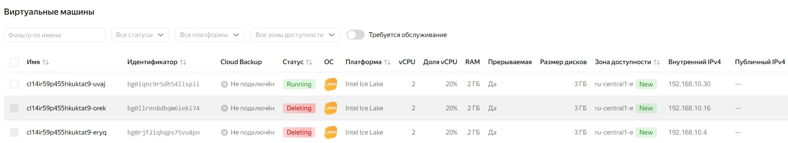
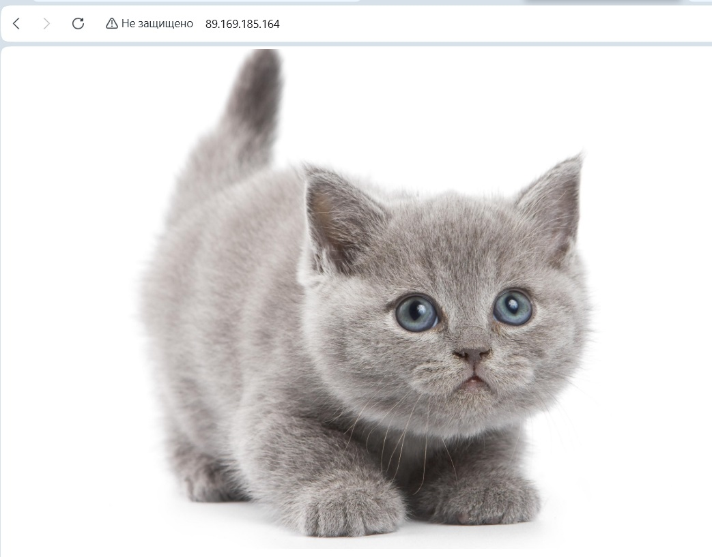

## Решение задания 1

1. Создание бакета Object Storage, размещение в нём файл с картинкой, проверка доступа из интернета:

2. Создание Instance Group с тремя ВМ и шаблоном LAMP:

Размещение в стартовой веб-странице ссылку на картинку из бакета:

3. Создание сетевого балансировщика:

Проверка работоспособности, удалив несколько ВМ:

